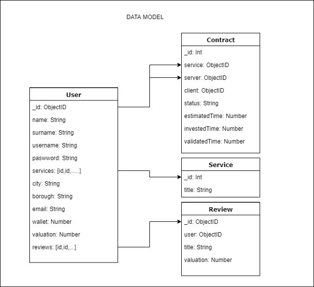
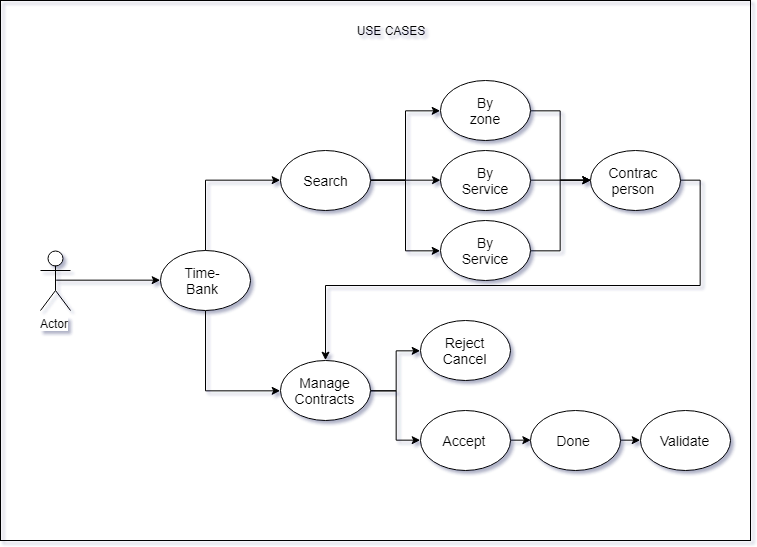

# TIME'S BANK PROJECT
### A place to share our time and knowledge with other people.

## DESCRIPTION

The project consists of a place where users can share their time with other users to access the capabilities of each one of them.

## STYLES

- [DATA MODEL](docs/DataModel.png)
- [MOCKUP](docs/Mockup.png)
- [USE CASES](docs/UseCases.png)

## Personal API's and APP

- API Client, API Server and Client APP

## TECHNOLOGIES

- CSS FRAMEWORK: BOOTSRAP 4
- Express
- MongoDB
- Node Server
- REACT
- REACT-ROUTER

## FLOW

- **Seach a service**: Users can search a service, by descripton, city and borough.

- **Contract a user and flow**: Once the user is found, we request the service generating a contract with pending status. This contract may be accepted or cancelled by the contract server or rejected by the client. After the server ends the service and later the client values the server service.

- **Contracts Flow**: The initial state of a contract is 'pending'. The client can change it to reject and the server can cancel it.The following states of an accepted contract are, 'done' when the server has finished the service and 'validated' when the client validates it.

## DEVELOPER: Mario Montalbán

- [GITHUB](https://github.com/Monty4/Time-Bank/tree/develop)

## PLANNING:
- [TRELLO BOARD](https://trello.com/b/1Gl3tS01/time-bank)

## PROJECT

- [TIME-BANK FINAL PROJECT](http://time-bank.surge.sh/)